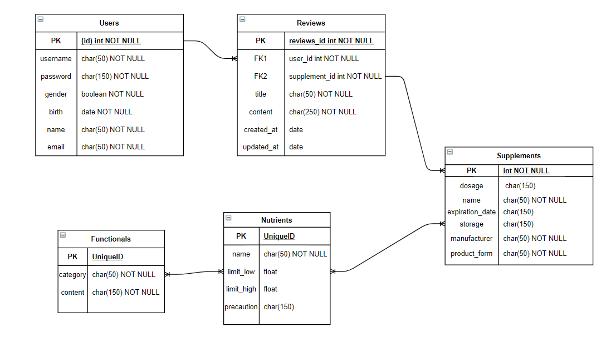
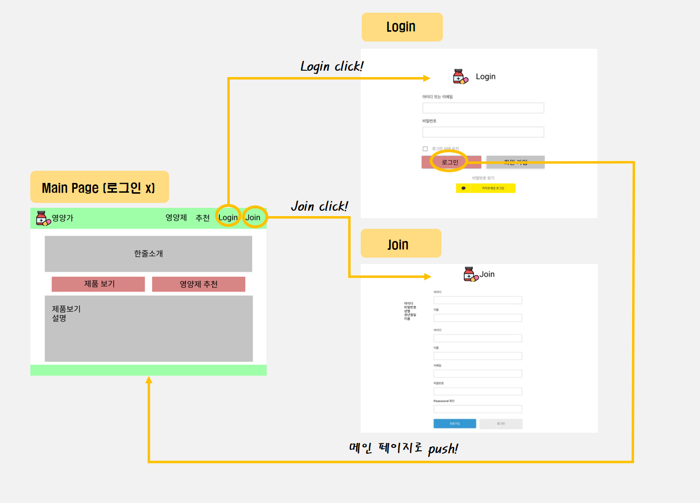
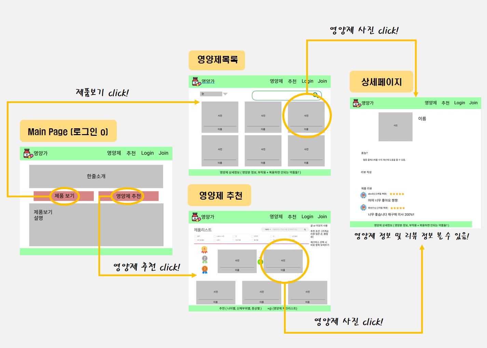

<p align=center style="line-height: 2;">

</p>


<p align=center>
  <b>Supported Frameworks</b><br/>
 &nbsp;&nbsp;
  
</p>

<hr>

## 📃 Git Flow

#### Git Branch

- Master

  - Develop

    - Front

      - feature/front/{기능}

    - Back

      - feature/back/{기능}

#### Git Commit Message

<p align=center style="line-height: 2;">
    <a>:emoji: | (맨처음 대문자) 이해하기 쉽게 최대한영어로 | Jira 이슈 코드번호</a>
<br>

</p>


## ⚙️ Installation

#### Backend

```bash
$ cd backend
$ pip install -r requirements.txt
$ python manage.py makemigrations
$ python manage.py migrate
$ python manage.py loaddata categories.json
$ python manage.py loaddata functionals.json
$ python manage.py loaddata nutrients.json
$ python manage.py loaddata supplements.json
$ python manage.py runserver
```

#### Frontend

```bash
$ cd frontend
$ npm install
$ npm run serve
```


## :earth_americas: Supported Browsers

<p align=center>
 
</p>


## 📼 Demos

Check our [Demos](http://j3a506.p.ssafy.io/). (Coming soon~😎)


## 📖 Documentation

#### ERD



#### Wireframe

- 로그인 x
  - 영양제 제품보기 페이지는 접근 가능
  - 영양제 추천 페이지는 제한



- 로그인 o
  - 모든 페이지 접근 가능


